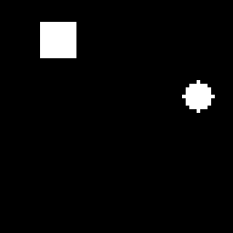
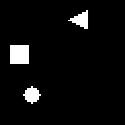
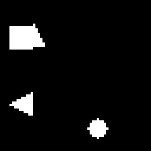
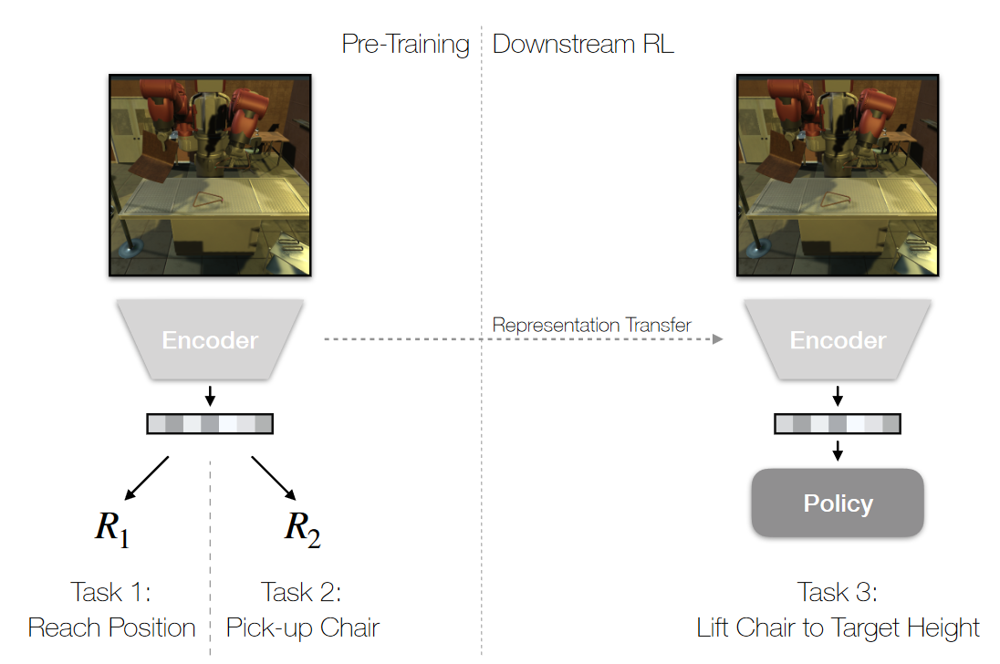
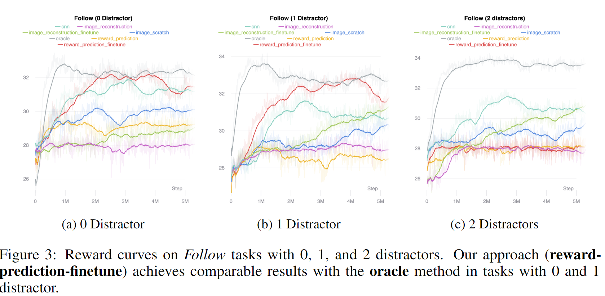
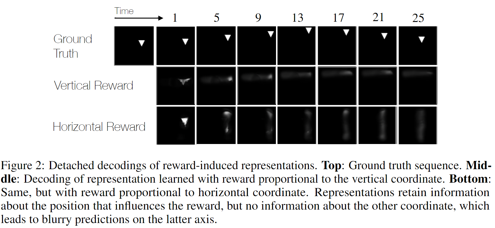
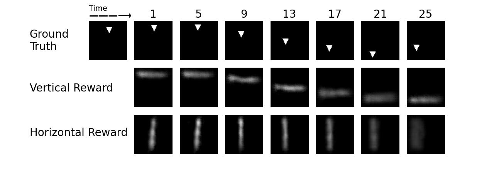
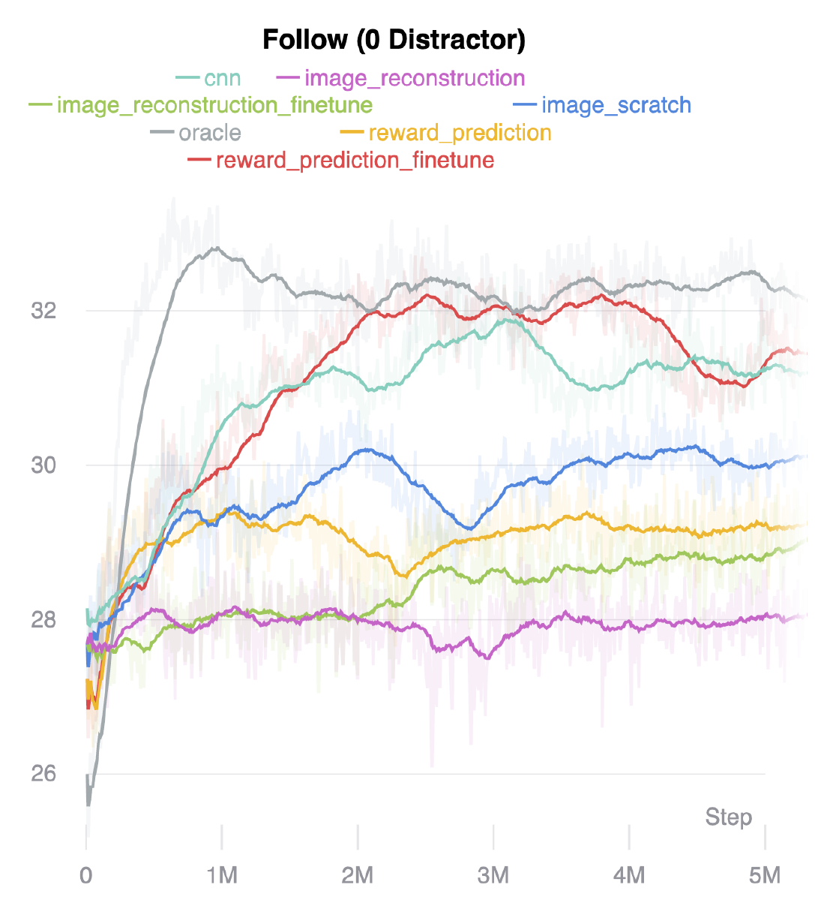

# Reward-Induced Representation Learning

Implementation of

[Reward-Induced Representation Learning](https://drive.google.com/file/d/1RoQ-QUNmeL-vGFKBX95IF-D_LiXcO93z/view) by

[Ayush Jain](https://ayushj240.github.io/), [Youngwoon Lee](https://youngwoon.github.io/), and [Karl Pertsch](https://kpertsch.github.io/).

  

| agent | target | distractor |
|:---:|:---:|:---:|
| **◯** | **▢** | **◁** |


[[Paper](https://drive.google.com/file/d/1RoQ-QUNmeL-vGFKBX95IF-D_LiXcO93z/view)] [[Starter code](https://github.com/kpertsch/clvr_impl_starter)]

---

## Overview

Reward-induced reward learning is a method to pretrain a model to learn a good representation of the environment by predicting the reward. We then use this learned representation to learn downstream tasks.

<div align="center">



</div>

With this method, we find that the learned method is better for some, but not all, downstream tasks.

<div align="center">



</div>

----

## Getting Started

If you prefer to manually install dependencies, create a virtual environment with [`conda`](https://github.com/conda/conda) and install all required packages.

```
conda create --name clvr python=3.7 torch=2.1.0
conda activate clvr
pip install -r requirements.txt
```

----

## Codebase Summary

### Reward-Induced Representation Learning (Figure 2)
* [`model.py`](model.py): Implementation of the reward-induced representation learning model
* [`train_encoder.py`](train_encoder.py): Training the encoder for reward-induced representation learning and the `image_reconstruction` baseline for RL)
* [`train_decoder.py`](train_decoder.py): Training the decoder (for reward-induced representation learning)
* [`create_figure2.py`](create_figure2.py): The file to recreate the results of Figure 2 of the paper (reward-induced representation learning)

### Baseline Training (Figure 3)
* [`baselines.py`](baselines.py): Implementation of all the baselines for RL testing
* [`ppo.py`](ppo.py): Implementation of PPO, for training the RL agent on all the baselines
* [`train_encoder.py`](train_encoder.py): Training the encoder for the `image_reconstruction` baseline for RL
* [`train_baseline.py`](train_baseline.py): The file to train each of the baselines

---- 

## Tasks

The tasks are described in section 6 of the paper.

### [Task 1] Implementing the reward-induced representation learning model

We implement the reward-induced representation learning model (`RewardPredictor`) in [`model.py`](model.py) as follows:

<div align="center">

`RewardPredictor` = `Encoder` + `MLP` + `LSTM` + `reward_heads`

</div>

### [Task 2] Replicating [Figure 2](imgs/figure_2.png)

We can replicate Figure 2 by using our implementation of the reward-induced representation learning model with [`create_figure2.py`](create_figure2.py):

```python
python create_figure2.py
```

|  |
|:---:|
|  |


### [Task 3] Implementing the RL algo (PPO) and verifying on the `Oracle` baseline

We first implement PPO with the following logic:

```python
for epoch in range(num_epochs):
    for t in range(local_steps_per_epoch):
        policy_rollout()
        calculate_advantages()
    
    for t in range(update_epochs):
        update_policy() # calculating loss
```

To verify that out PPO implementation is correct, we can train the agent on the `Oracle` baseline, which is the baseline that has the highest reward:

```python
python train_baseline.py --baseline_class 'oracle'
```

### [Task 4 - 5] Replicating [Figure 3](imgs/figure_3.png)

<div align="center">

 

</div>


We can replicate Figure 3 by using our implementation of PPO on the other baselines with [`train_baseline.py`](train_baseline.py):

```python
python train_baseline.py --baseline_class <baseline_class> --env_type <env_type> \
    --num_distractors <num_distractors> --total_timesteps <total_timesteps> --seed <seed>
```

For example, we can train all the necessary agents for Figure 3(a) by running the following commands:

```python
python train_baseline.py -b 'cnn'
python train_baseline.py -b 'image_reconstruction'
python train_baseline.py -b 'image_reconstruction_finetune'
python train_baseline.py -b 'image_scratch'
python train_baseline.py -b 'oracle'
python train_baseline.py -b 'reward_prediction'
python train_baseline.py -b 'reward_prediction_finetune'
```

---

<details>
    <summary><b>❗Error in HorPosReward and VerPosReward in reward.py❗</b></summary>

### Error in `VertPosReward` and `HorPosReward` in [`reward.py`](https://github.com/kpertsch/clvr_impl_starter/blob/master/sprites_datagen/rewards.py)
In the original rewards function file [`rewards.py`](https://github.com/kpertsch/clvr_impl_starter/blob/master/sprites_datagen/rewards.py) from the [starter code repo](https://github.com/kpertsch/clvr_impl_starter), we have the following rewards:

```python
class VertPosReward(Reward):
    """Returns reward proportional to the vertical position of the first object."""
    NAME = 'vertical_position'

    def __call__(self, trajectories, shapes):
        return trajectories[:, 0, 1]

class HorPosReward(Reward):
    """Returns reward proportional to the horizontal position of the first object."""
    NAME = 'horizontal_position'

    def __call__(self, trajectories, shapes):
        return trajectories[:, 0, 0]

class AgentXReward(Reward):
    """Returns reward proportional to the horizontal position of the agent. Assumes that agent is the first object."""
    NAME = 'agent_x'

    def __call__(self, trajectories, shapes):
        return trajectories[:, 0, 1]


class AgentYReward(Reward):
    """Returns reward proportional to the vertical position of the agent. Assumes that agent is the first object."""
    NAME = 'agent_y'

    def __call__(self, trajectories, shapes):
        return trajectories[:, 0, 0]


class TargetXReward(Reward):
    """Returns reward proportional to the horizontal position of the target. Assumes that target is second object."""
    NAME = 'target_x'

    def __call__(self, trajectories, shapes):
        return trajectories[:, 1, 1]


class TargetYReward(Reward):
    """Returns reward proportional to the vertical position of the target. Assumes that target is the second object."""
    NAME = 'target_y'

    def __call__(self, trajectories, shapes):
        return trajectories[:, 1, 0]

```

`trajectories` contains information in the form of `[batch_size, num_objects, (y,x) position]`.

Also, `AgentXReward` and `TargetXReward` have a third index value of 1 (the x value), while `AgentYReward` and `TargetYReward` have a third index value of 0 (the y value). 

From this, we can see that `VertPosReward` and `HorPosReward` are incorrect and swapped - `VertPosReward` should be returning the y value (`AgentYReward`, or `trajectories[:, 0, 0]`), and `HorPosReward` should be returning the x value (`AgentXReward`, or `trajectories[:, 0, 1]`).

### Correct implementation of `VertPosReward` and `HorPosReward`
The correct implementation (which is applied to [`rewards.py`](sprites_datagen\rewards.py) in this repo) is as follows:

```python
class VertPosReward(Reward):
    """Returns reward proportional to the vertical position of the first object."""
    NAME = 'vertical_position'

    def __call__(self, trajectories, shapes):
        return trajectories[:, 0, 0]

class HorPosReward(Reward):
    """Returns reward proportional to the horizontal position of the first object."""
    NAME = 'horizontal_position'

    def __call__(self, trajectories, shapes):
        return trajectories[:, 0, 1]
```
</details>